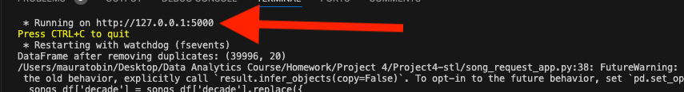

# Project4-stl

# Collaborators: Maura Tobin, Jordan Johnson-Williams, Evan Robinson, Monica Phatangare, Paul Keller

This project used a dataset of 40,000 songs collected from the music streaming app Spotify. This data was
used to create two machine learning models. One was a K Nearest Neighbors model that predicted the most similar songs based on the selection of any given song in the dataset. Another was a Supervised Learning model that tested the reliability of correctly matchings songs in the dataset to its correct genre.

## K Nearest Neighbor
The K Nearest Neigbor model was used to determine what eight songs in the Spotify dataset were most similar to a song selected by the user given the selected song was already in the dataset.

### Dataset
The corresponding dataset contained twenty features:
* Track: Track/Song Title (Object)
* Artist: Performer (Object)
* URI: Spotify Song Identifier (Object)
* Danceability: Dance to Song Scale; 0 = Least Danceable; 1 = Most Danceable (Float64)
* Energy: Energy to Song Scale; 0 = Least Energy; 1 = Most Energy (Float64)
* Key: Key of Song; 0=C, 1=C#/Db, 2=D, 3=D#/Eb, 4=E, 5=F, 6=F#/Gb, 7=G, 8=G#/Ab, 9=A, 10=A#/Bb, 11=B (Int64)
* Loudness: ??? (Float64)
* Mode: Song Charting on Billboard Top 100; 0 = Did not Chart; 1 = Did Chart (Int64)
* Speechiness: Speech to Song Scale; 0 = Least Speech; 1 = Most Speech (Float64)
* Acousticness: Acoustic to Song Scale; 0 = Least Acoustic; 1 = Most Acoustic; (Float64)
* Instrumentalness: Instrument to Song Scale; 0 = Least Instrumental, 1 = Most Instrumental; (Float64)
* Liveness:
* Valence
* Tempo
* Duration_ms
* Time_Signature
* Chorus_Hit
* Sections
* Popularity
* Decades: Decade of Song (Object)

### Procedure
The dataset was cleaned so that no song duplicates existed. Dummy variables for the categorical feature decades were created. In the end the features that were included in the model were Danceability, Energy, Acousticness, Liveness, Valence, Popularity, and each Decade. After applying weights to each of the features, a K Nearest Neighbors model was created. The model was driven by user input. After a song was entered by the user, provided the song is in the dataset, the 1-10 most similar songs determined by the model were produced. Additionally, an app driven by Flask provided a link to the song on Spotify for the user to listen to.

## Apache Spark SQL in the Project
In this project, Apache Spark SQL is used to efficiently query and process large datasets with SQL syntax. It enables seamless integration of structured data through Spark DataFrames, allowing complex transformations and analyses across distributed systems.
# Key Features:
* DataFrame Integration:
    Converts a Pandas DataFrame to a Spark DataFrame for distributed processing.
    ```songs_df = spark.createDataFrame(song_df) ```
* Temporary Views:
    Registers a Spark DataFrame as a temporary SQL table for querying.
    ```songs_df.createOrReplaceTempView("songs")```
* SQL Queries:
    Runs SQL queries to transform data, such as converting categorical values (e.g., decades) into numeric values.
    ```spark.sql("SELECT ... FROM songs")```
* Efficient Data Processing:
    Leverages Spark's Catalyst optimizer for efficient query execution on large-scale data.
    Spark SQL simplifies data manipulation, making it an essential tool for big data analysis with minimal code complexity.

## Preprocessing
I started by cleaning the dataset and removing duplicate songs. I also added two new columns, 'track_lower' and 'artist_lower' to make searching the song and artist easier in the end function.
```songs_df['track_lower'] = songs_df['track'].str.strip().str.lower()```
```songs_df['artist_lower'] = songs_df['artist'].str.strip().str.lower()```
I used get_dummies on the decade column to create new columns with only 0s and 1s instead of a string, so that the decades can be properly scaled and weighted for machine learning.
## Scaling Features and Applying Weights
I choose which features to use and scaled them with the MinMaxScaler, since most of the columns were already between 0 an 1.
Once scaling, I added weights to each feature. I experimented with the weights until I ended up with this:

weights = {
    'danceability': 1.0,
    'energy': 1.5,
    'acousticness': 1.0,
    'liveness': 1.0,
    'valence': 1.5,
    'popularity': 0.5,
    'decade_60s': 0.5,
    'decade_70s': 0.5,
    'decade_80s': 0.5,
    'decade_90s': 0.5,
    'decade_00s': 0.5,
    'decade_10s': 0.5
}

I added more weight to energy and valence, because I think those are important factors for a recommended song and less weight to popularity and the decades. I applied the weights to the scaled features and then used those to train the NearestNeighbors model.
## Creating Charts and Recommendation Function
I created a Bar Chart and a t-SNE chart to visually graph the input song's features and compare that to the recommended songs features.
Then I created to function to take an input song and artist, and then search for the closest recommendation songs based on the features. The only caveat was that the recommendation songs could not be by the same artist as the input song.
The function takes a song, and artist, and number of recommendations and then lists out the recommendations in order and also plots the two charts.

## Spotify URI to URL Conversion Script
This script processes a dataset of Spotify track URIs and converts them into clickable URLs for easier access and sharing. 

# How It Works
* Conversion Function:
    * A function (convert_uri_to_url) is defined to transform Spotify track URIs (e.g., spotify:track:...) into clickable URLs (e.g., https://open.spotify.com/track/...).
    * Only valid Spotify URIs are processed; invalid entries are handled gracefully.
* Application:
    * The function is applied to the ‘uri’ column of the dataset, generating a new ‘url’ column with the corresponding Spotify track links.
* Export:
    * The updated dataset, including the new ‘url’ column, is saved as a CSV file (updated_file.csv).
* Verification:
    * The script displays the first few rows of the updated DataFrame and ensures URLs are fully visible in the console.
* Usage
    * Ensure your dataset has a column named ‘uri’ containing valid Spotify track URIs.
    * Run the script to generate the ‘url’ column and save the updated dataset.
    * Use the exported CSV file (updated_file.csv) for further analysis or sharing.
* Key Features
    * Converts Spotify track URIs to URLs efficiently.
    * Saves the updated data for future use.
    * Handles invalid URIs by returning None for such cases.
    * This script is ideal for anyone working with Spotify datasets and looking to create easily shareable track links.

## Song Request App
The song request app is a python file that runs our processing code to allow a user to enter a song and artist and the number of recommended songs they would like. For the results, the user will get 1-10 recommendations (depending on how many they selected) with clickable Spotify links. To run the song request app, open the terminal within the song_request_app.py file and type ``` python song_request_app.py``` and follow the link.



When you click on the spotify links to the song recommendations, make sure you right click and "open link in new tab" so you don't lose your app!

